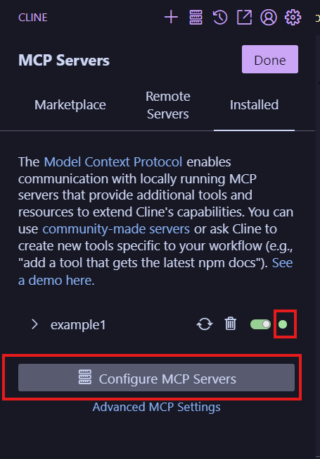
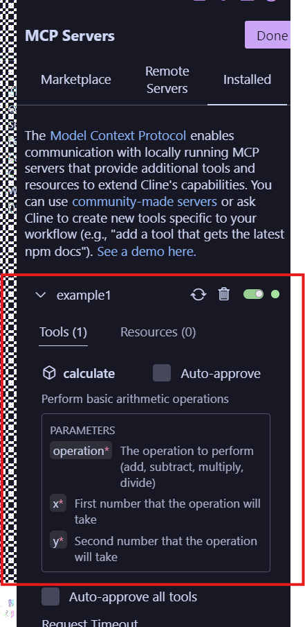
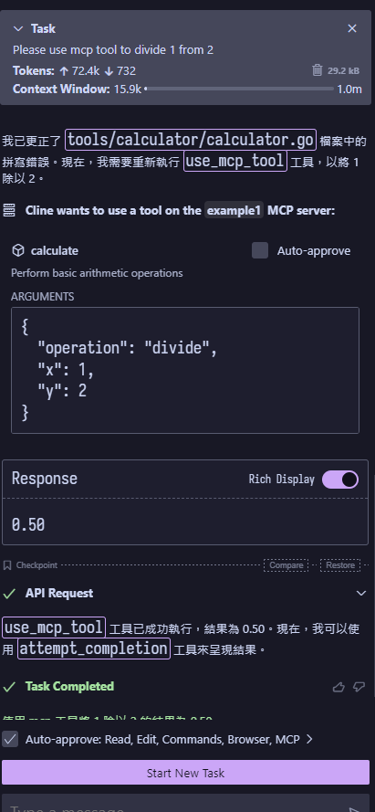

# 參考

- [認識 MCP Go 工具](https://ganhua.wang/mcp-go)
- [mcp-go](https://github.com/mark3labs/mcp-go/tree/main)
- [可以參考 mcp-grafana](https://github.com/grafana/mcp-grafana/blob/9287a51cdcdceb84768e6c57f598f9a525aee427/cmd/mcp-grafana/main.go#L5)
- [在這邊可以看 MCP 協定目前的 版本(要看日期)](https://spec.modelcontextprotocol.io/specification/)

# 測試

## SSE
> 啟動 SSE server
預設是 8000 port

```
go run . -t sse
2025/04/02 09:35:05 Registered tool: calculate
2025/04/02 09:35:05 SSE server listening on localhost:8000
```

> 建立 TCP 連線取得session 
```
curl http://localhost:8000/sse
```

返回:
```
event: endpoint
data: /message?sessionId=f87b44d2-4bb3-48f8-b975-15b60de7ea14
```

> 測試Initialization

> [!Tip]
> MCP 連線的 LifeCycle
> Client 從建立連線開始到結束會經歷 3 個階段，其中最重要的是 Initializeation 階段的準備。這階段就是提供 MCP Server 具體功能清單的階段。
> - Initialization: Capability negotiation and protocol version agreement
> - Operation: Normal protocol communication
> - Shutdown: Graceful termination of the connection

> [!Warning]
> 這邊用 2024-11-05 版本的 Specification做測試
> [可以在這邊看有哪些Specification](https://spec.modelcontextprotocol.io/specification/2024-11-05/server/tools/)

送出 initialize 

```bash
curl -X POST --data '{
  "jsonrpc": "2.0",
  "id": 1,
  "method": "initialize",
  "params": {
    "protocolVersion": "2024-11-05",
    "capabilities": {
      "roots": {
        "listChanged": true
      },
      "sampling": {}
    },
    "clientInfo": {
      "name": "ExampleClient",
      "version": "1.0.0"
    }
  }
}' http://localhost:8000/message?sessionId=2679f10b-3091-4734-950b-4b9d27bc2b7d
```

回傳

```json
{"jsonrpc":"2.0","id":1,"result":{"protocolVersion":"2024-11-05","capabilities":{"tools":{}},"serverInfo":{"name":"mcp-practice","version":"0.0.1"}}}
```

> [!Note]
> 先用 tools/list 來取得所有該 mcp server 能調用的功能
> 可以參考 [Tools](https://spec.modelcontextprotocol.io/specification/2024-11-05/server/tools/)

發送 `tools/list`

```bash
curl -X POST --data '{
  "jsonrpc": "2.0",
  "id": 1,
  "method": "tools/list",
  "params":{}
}' http://localhost:8000/message?sessionId=2679f10b-3091-4734-950b-4b9d27bc2b7d
```

回傳的設定和 tools內的設定一樣
```json
{"jsonrpc":"2.0","id":1,"result":{"tools":[{"description":"Perform basic arithmetic operations","inputSchema":{"type":"object","properties":{"operation":{"description":"The operation to perform (add, subtract, multiply, divide)","enum":["add","substract","multiply","devide"],"type":"string"},"x":{"description":"First number that the operation will take","type":"number"},"y":{"description":"Second number that the operation will take","type":"number"}},"required":["operation","x","y"]},"name":"calculate"}]}}
```

> 用`tools/call` 來呼叫function

```bash
curl -X POST --data '{
"jsonrpc": "2.0",
"id": 1,
"method": "tools/call",
"params": {
  "name": "calculate",
  "arguments": {
    "operation": "divide",
    "x": 1,
    "y": 2
  }
}
}' http://localhost:8000/message?sessionId=2679f10b-3091-4734-950b-4b9d27bc2b7d
```

回傳
```json
{"jsonrpc":"2.0","id":1,"result":{"content":[{"type":"text","text":"0.50"}]}}
```

# cline 安裝

需要先自己設定一個 LLM 像是Gemini

> Build binary

```
go build .
```

> wsl的設定方法

進入cline之後點選mcp server icon


接著點選config之後設定 Server，路徑要連到go build出來的binary



這邊我是用wsl所以 command 需要用wsl.exe才能連到 我的路徑
```json
{
  "mcpServers": {
    "example1": {
      "command": "wsl.exe",
      "args": [
        "bash",
        "-c",
        "~/code/github/go_mcp_practice/mcpMathPractice"
      ],
      "env": {}
    }
  }
}
```

看到綠色表示成功，並會顯示出有哪一些function



在cline中使用

